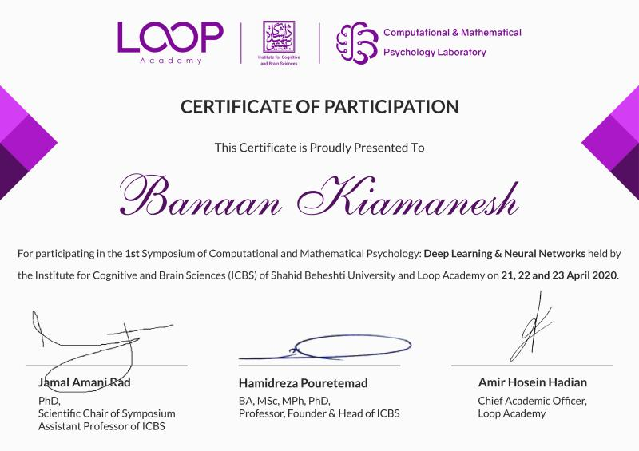
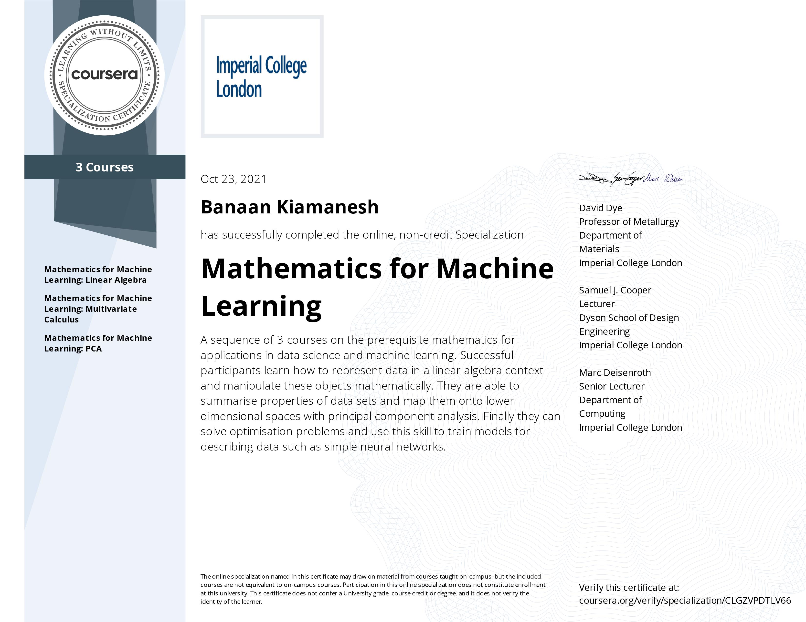
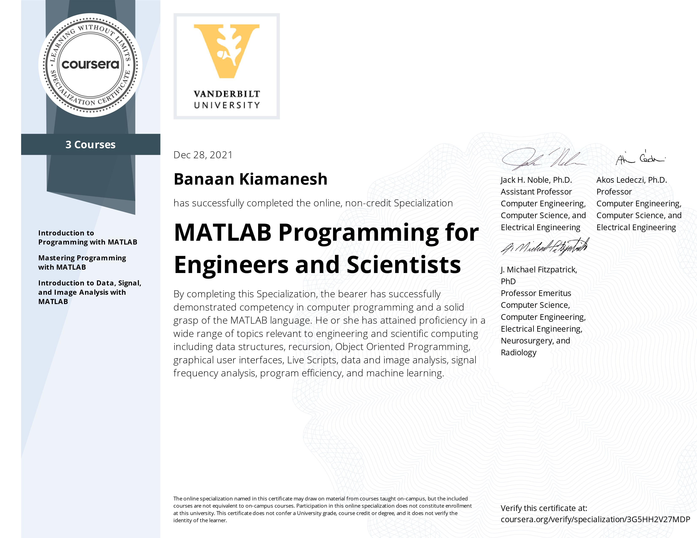

# My Certificates
___
## Mathematical Psychology: Deep Learning and Neural Networks - Shahid Beheshti University

___
## Mathematics for Machine Learning - Imperial College London
1. [Linear Algebra](https://www.coursera.org/verify/BB2NN94SPZJK)
2. [Multi-Variable Calculus](https://www.coursera.org/verify/MS7LAE2FD3G8)
3. [Principal Component Analysis](https://www.coursera.org/verify/923VR6SR9S6M)
4. ***[Full Course Certif](https://www.coursera.org/verify/specialization/CLGZVPDTLV66)***

___
## MATLAB Programming for Engineers and Scientists Specialization - Vanderbilt University
1. [Introduction to Programming with MATLAB](https://www.coursera.org/verify/URCJYST93VND)
2. [Mastering Programming with MATLAB](https://www.coursera.org/verify/Q6MFNN7UYEHP)
3. [Introduction to Data, Signal, and Image Analysis with MATLAB](https://www.coursera.org/verify/FL2UVRR6K4EJ)
4. ***[Full Course Certif](https://www.coursera.org/verify/specialization/3G5HH2V27MDP)***

{: target = "_blank"}
___
## Practical Data Science with MATLAB Specialization - Mathworks
1. [Exploratory Data Analysis with MATLAB](https://www.coursera.org/verify/DKRCEU7T847Y)
___
## Signal Processing: EEG Signals

___